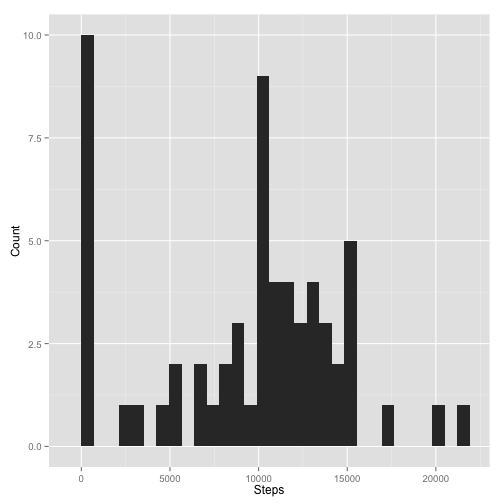
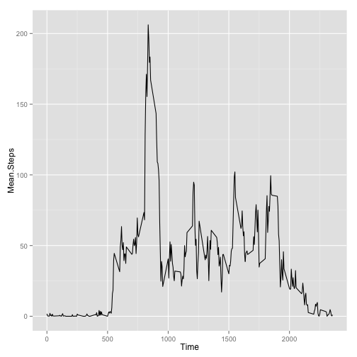
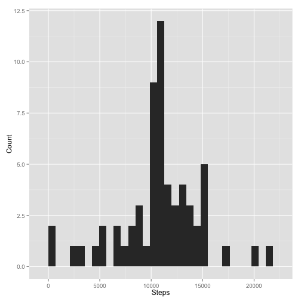
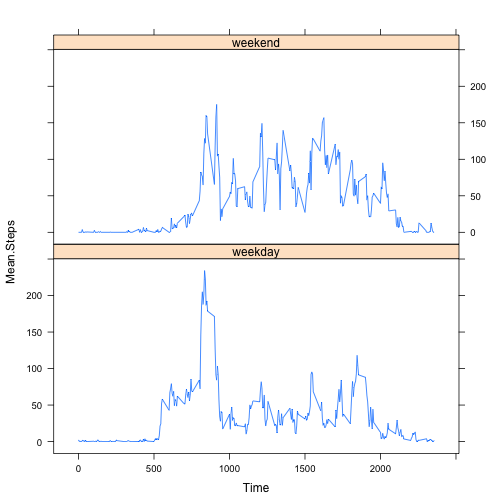

# Reproducible Research: Peer Assessment 1

Prepare for the analyis. Set your working directly as needed. 
In addition, this analysis requires the lattice and ggplot2 packages.


```r
library(lattice)
library(ggplot2)
setwd("/Users/phildow/Coursera/Data Analysis/Data Track/3.reproducible-research/RepData_PeerAssessment1/")
```


## Loading and preprocessing the data

Read in the activity data:


```r
data = read.csv("activity.csv")
```


Print a summary of the data object:


```r
summary(data)
```

```
##      steps               date          interval   
##  Min.   :  0.0   2012-10-01:  288   Min.   :   0  
##  1st Qu.:  0.0   2012-10-02:  288   1st Qu.: 589  
##  Median :  0.0   2012-10-03:  288   Median :1178  
##  Mean   : 37.4   2012-10-04:  288   Mean   :1178  
##  3rd Qu.: 12.0   2012-10-05:  288   3rd Qu.:1766  
##  Max.   :806.0   2012-10-06:  288   Max.   :2355  
##  NA's   :2304    (Other)   :15840
```


## What is mean total number of steps taken per day?

Make a histogram of the total number of steps taken each day:


```r
steps_by_date = with(data, aggregate(x = steps, by = list(date), FUN = function(x) sum(x, 
    na.rm = T)))
qplot(steps_by_date$x, xlab = "Steps", ylab = "Count")
```

```
## stat_bin: binwidth defaulted to range/30. Use 'binwidth = x' to adjust this.
```

 


Calculate and report the mean and median total number of steps taken per day:


```r
median_steps = median(steps_by_date$x, na.rm = T)
mean_steps = mean(steps_by_date$x, na.rm = T)
```


The mean number of daily steps is 9354.2295, and the median is 10395.

## What is the average daily activity pattern?

Make a time series plot (i.e. type = "l") of the 5-minute interval (x-axis) and the average 
number of steps taken, averaged across all days (y-axis):

That is, the number of steps taken in each time interval, averaged across all days.


```r
steps_by_time = with(data, aggregate(x = steps, by = list(interval), FUN = function(x) mean(x, 
    na.rm = T)))
names(steps_by_time) = c("Time", "Mean.Steps")
ggplot(steps_by_time, aes(x = Time, y = Mean.Steps)) + geom_line()
```

 


Which 5-minute interval, on average across all the days in the dataset, contains the maximum number of steps?


```r
max_interval = steps_by_time[which.max(steps_by_time$Mean.Steps), ]$Time
```


The 5 minute interval at 835 contains the greatest number of steps on average.

## Imputing missing values

Calculate and report the total number of missing values in the dataset 
(i.e. the total number of rows with NAs):


```r
num_missing_values = with(data, sum(is.na(steps)))
```


The total number of missing values is 2304.

Devise a strategy for filling in all of the missing values in the dataset. 
The strategy does not need to be sophisticated. For example, you could use the mean/median 
for that day, or the mean for that 5-minute interval, etc:

The selected strategy will using the mean value for the 5 minute interval across all days.

Create a new dataset that is equal to the original dataset but with the missing data filled in:


```r
imputed_data = data
for (i in 1:dim(imputed_data)[1]) {
    if (is.na(imputed_data[i, ]$steps)) {
        interval = imputed_data[i, ]$interval
        mean_value = steps_by_time[steps_by_time$Time == interval, ]$Mean.Steps
        imputed_data[i, ]$steps = mean_value
    }
}
```


Make a histogram of the total number of steps taken each day:


```r
imputed_steps_by_date = with(imputed_data, aggregate(x = steps, by = list(date), 
    FUN = function(x) sum(x, na.rm = T)))
qplot(imputed_steps_by_date$x, xlab = "Steps", ylab = "Count")
```

```
## stat_bin: binwidth defaulted to range/30. Use 'binwidth = x' to adjust this.
```

 


Calculate and report the mean and median total number of steps taken per day:


```r
imputed_median_steps = median(imputed_steps_by_date$x, na.rm = T)
imputed_mean_steps = mean(imputed_steps_by_date$x, na.rm = T)
```


The new mean and median number of steps using imputed values are the same, namely mean = 1.0766 &times; 10<sup>4</sup> and median = 1.0766 &times; 10<sup>4</sup>.

Do these values differ from the estimates from the first part of the assignment? 
What is the impact of imputing missing data on the estimates of the total daily number of steps?

Yes, naturally, the new values differ from the estimates in the first part of the assignment.
The values are higher, they are identical, and the distribution of steps is more normal.

## Are there differences in activity patterns between weekdays and weekends?

Create a new factor variable in the dataset with two levels -- "weekday" and "weekend" 
indicating whether a given date is a weekday or weekend day.


```r
data$weekday = weekdays(as.Date(data$date))
weekends = (data$weekday == "Saturday" | data$weekday == "Sunday")

data$weektime = "weekend"
data[!weekends, ]$weektime = "weekday"

data$weektime = as.factor(data$weektime)
```


Make a panel plot containing a time series plot (i.e. type = "l") of the 5-minute interval (x-axis) 
and the average number of steps taken, averaged across all weekday days or weekend days (y-axis). 
The plot should look something like the following, which was creating using simulated data:


```r
steps_by_time_and_weektime = with(data, aggregate(x = steps, by = list(interval, 
    weektime), FUN = function(x) mean(x, na.rm = T)))
names(steps_by_time_and_weektime) = c("Time", "Weektime", "Mean.Steps")
xyplot(Mean.Steps ~ Time | Weektime, data = steps_by_time_and_weektime, layout = c(1, 
    2), type = "l")
```

 

